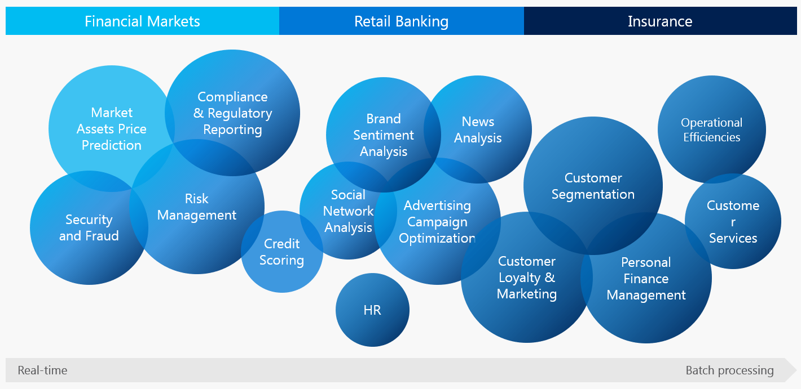

# AI in Finance

_The purpose of this project is to describe the cases of application of __Artificial Intelligence (AI)__ 
technologies in the __financial sector__._

_Warning_: In the first version of the project we will describe cases typical for retail banks (see [Rodmap](#roadmap)).

#### Project Structure
1. Retail banking:
    - [Cases](retail-banking-cases.md)
    - [Datasets](datasets.md)
    - [Hackathons and competitions](hackathons.md)
    - [Conferences](conferences.md).

#### Roadmap
1. AI cases in Financial markets;
2. AI cases in Insurance.